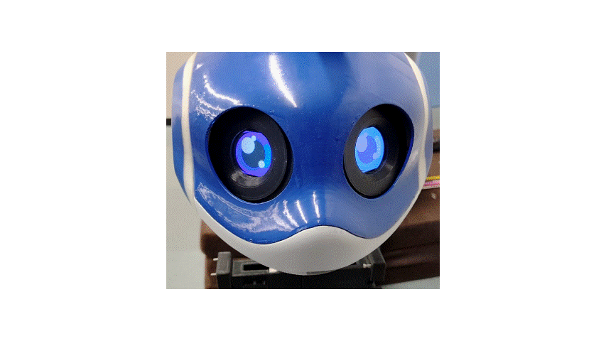

<a name="readme-top"></a>

[JA](README.md) | [EN](README.en.md)

[![Contributors][contributors-shield]][contributors-url]
[![Forks][forks-shield]][forks-url]
[![Stargazers][stars-shield]][stars-url]
[![Issues][issues-shield]][issues-url]
[![License][license-shield]][license-url]

# ESP32 Display

<!-- Table of Contents -->
<details>
  <summary>Table of Contents</summary>
  <ol>
    <li>
      <a href="#overview">Overview</a>
    </li>
    <li>
      <a href="#setup">Setup</a>
      <ul>
        <li><a href="#environment">Environment</a></li>
        <li><a href="#installation">Installation</a></li>
      </ul>
    </li>
    <li><a href="#usage">Usage</a></li>
    <li><a href="#parameters">Parameters</a></li>
    <li><a href="#milestone">Milestone</a></li>
    <li><a href="#references">References</a></li>
  </ol>
</details>


<!-- Overview -->
## Overview

This repository controls the display mounted on the head of [SOBIT MINI](https://github.com/TeamSOBITS/sobit_mini) and [SOBIT LIGHT](https://github.com/TeamSOBITS/sobit_light).

While no data is being sent, the display shows blinking eyes. While data is being sent, it can show any image for a specified time.

It also automatically detects the use of TTS and STT, and shows a speaker or microphone image while they are in use.

<p align="center">
  
</p>

<p align="right">(<a href="#readme-top">back to top</a>)</p>


## Setup

This section explains how to set up this repository.

### Environment

Before moving on to the installation, prepare the following environment.

| System  | Version |
| ------------- | ------------- |
| Ubuntu | 24.04 (Noble Numbat) |
| ROS | Jazzy Jalisco |
| Python | 3.12 |

<p align="right">(<a href="#readme-top">back to top</a>)</p>

### Installation

1. Go to the `src` folder of your ROS workspace.
   ```sh
   cd ~/colcon_ws/src/
   ```
2. Clone this repository.
   ```sh
   git clone -b jazzy-devel https://github.com/TeamSOBITS/esp32_display.git
   ```
3. Move into the repository.
   ```sh
   cd esp32_display/
   ```
4. Install the dependencies.
   ```sh
   bash install.sh
   ```
5. Build the package.
   ```sh
   cd ~/colcon_ws/
   ```
   ```sh
   colcon build --symlink-install
   ```
   ```sh
   source ~/colcon_ws/install/setup.sh
   ```


<p align="right">(<a href="#readme-top">back to top</a>)</p>

<!-- Usage -->
## Usage
The following modes are available.

| Mode | Description | Trigger | Example |
| --- | --- | --- | --- |
| Blinking eyes | Shows blinking eyes | Power supply to the ESP32 |  |
| Microphone image | Detects microphone use during speech recognition and shows the microphone image | Launch [esp32_display.launch.py](launch/esp32_display.launch.py) |  |
| Speaker image | Detects speech while using [Sobits TTS](https://github.com/TeamSOBITS/sobits_tts) and shows the speaker image | Launch [esp32_display.launch.py](launch/esp32_display.launch.py) |  |
| Still image | Shows an image for the specified number of seconds, given its absolute path and the duration (can be cancelled at any time) | Launch [esp32_display.launch.py](launch/esp32_display.launch.py) and [display_client.py](esp32_display/display_client.py) | - |
| Image topic | Shows an image topic for the specified number of seconds, given its topic name and the duration (can be cancelled at any time) | Launch [esp32_display.launch.py](launch/esp32_display.launch.py) and [display_client.py](esp32_display/display_client.py) | - |

1. Connect the ESP32.
2. Launch [esp32_display.launch.py](launch/esp32_display.launch.py).
   ```sh
   ros2 launch esp32_display esp32_display.launch.py
   ```
3. In `main()` of [display_client.py](esp32_display/display_client.py), edit `topic_name` and `file_path` to match what you want to show.
   - To show an image topic, set the topic name in `topic_name` and an empty string in `file_path`.
     ```python
     topic_name = "/topic_name"
     file_path = ""
     ```
   - To show a still image, set an empty string in `topic_name` and the absolute path of the image file in `file_path`.
     ```python
     topic_name = ""
     file_path = "/absolute/path/to/image.jpeg"
     ```
4. Launch [display_client.py](esp32_display/display_client.py). It asks for the number of seconds to show the image; enter an integer.
   ```sh
   ros2 run esp32_display display_client
   ```

- Image files in formats such as jpeg and png are supported.

<p align="right">(<a href="#readme-top">back to top</a>)</p>

## Parameters
The following parameters can be set in [esp32_display.launch.py](launch/esp32_display.launch.py).

| Parameter | Description | Default |
| --- | --- | --- |
| quality | Quality of the image drawn on the display. Minimum 1, maximum 100; higher is better. Because of the microcontroller's performance, 50 is the limit at 320×240. | 30 |
| image_hight | Height of the image drawn on the display (the spelling `hight` matches the parameter name in the code) | 240 |
| image_width | Width of the image drawn on the display | 320 |

<p align="right">(<a href="#readme-top">back to top</a>)</p>


<!-- Milestone -->
## Milestone
- Add a feature that detects people and makes the pupils follow them

To check current bugs and feature requests, see the [Issues page][issues-url].

<p align="right">(<a href="#readme-top">back to top</a>)</p>

<!-- References -->
## References

* [ESP32-S3-DevKitC-1](https://docs.espressif.com/projects/esp-dev-kits/en/latest/esp32s3/esp32-s3-devkitc-1/index.html)
* [ILI9341](https://cdn-shop.adafruit.com/datasheets/ILI9341.pdf)

<p align="right">(<a href="#readme-top">back to top</a>)</p>

<!-- MARKDOWN LINKS & IMAGES -->
<!-- https://www.markdownguide.org/basic-syntax/#reference-style-links -->
[contributors-shield]: https://img.shields.io/github/contributors/TeamSOBITS/esp32_display.svg?style=for-the-badge
[contributors-url]: https://github.com/TeamSOBITS/esp32_display/graphs/contributors
[forks-shield]: https://img.shields.io/github/forks/TeamSOBITS/esp32_display.svg?style=for-the-badge
[forks-url]: https://github.com/TeamSOBITS/esp32_display/network/members
[stars-shield]: https://img.shields.io/github/stars/TeamSOBITS/esp32_display.svg?style=for-the-badge
[stars-url]: https://github.com/TeamSOBITS/esp32_display/stargazers
[issues-shield]: https://img.shields.io/github/issues/TeamSOBITS/esp32_display.svg?style=for-the-badge
[issues-url]: https://github.com/TeamSOBITS/esp32_display/issues
[license-shield]: https://img.shields.io/github/license/TeamSOBITS/esp32_display.svg?style=for-the-badge
[license-url]: LICENSE
